# DB仕様

```mermaid
erDiagram
    events ||--o{ articles : "event_id"
    events ||--o{ event_members : "event_id"
    users ||--o{ event_members : "user_id"
    users ||--o{ articles : "created_by"
    articles ||--o{ article_histories : "article_id"
    users ||--o{ article_histories : "created_by"
    articles ||--o| article_schedules : "article_id"
    users ||--o{ article_schedules : "created_by"
    events ||--o{ event_days : "event_id"
    events ||--o{ places : "event_id"
    events ||--o{ committees : "event_id"
    events ||--o{ tags : "event_id"
    events ||--o{ bottom_navs : "event_id"
    events ||--o{ features : "event_id"
    events ||--o| forecast_areas : "event_id"
    articles ||--o{ article_tags : "article_id"
    tags ||--o{ article_tags : "tag_id"
    articles ||--o| posts : "id"
    articles ||--o| shops : "id"
    articles ||--o| artists : "id"
    committees ||--o{ posts : "committee_id"
    event_days ||--o{ shops : "event_day_id"
    event_days ||--o{ artists : "event_day_id"
    event_days ||--o{ schedule_columns : "event_day_id"
    places ||--o{ shops : "place_id"
    places ||--o{ artists : "place_id"
    shops ||--o{ products : "shop_id"
    schedule_columns ||--o{ schedule_events : "schedule_column_id"
    artists ||--o{ schedule_events : "artist_id"
    event_members ||--o| authorities : "user_id, event_id"

    events {
        uuid id PK
        text slug UK
        text name
        timestamptz created_at
        timestamptz updated_at
    }

    articles {
        uuid id PK
        uuid event_id FK
        text slug UK
        uuid created_by FK
        integer latest_version FK
        integer published_version FK
        article_status status
        timestamptz published_at
        timestamptz created_at
        timestamptz updated_at
    }

    article_histories {
        uuid id PK
        uuid article_id FK,UK
        integer version UK
        uuid created_by FK
        text title
        jsonb content
        timestamptz created_at
        timestamptz updated_at
    }

    article_schedules {
        uuid article_id PK,FK
        integer version FK
        timestamptz publish_at
        uuid created_by FK
        timestamptz created_at
        timestamptz updated_at
    }

    users {
        uuid id PK "auth.users.id"
        text display_name
        timestamptz created_at
        timestamptz updated_at
        timestamptz deleted_at
    }

    event_members {
        uuid user_id PK,FK
        uuid event_id PK,FK
        event_member_role role
        timestamptz created_at
        timestamptz updated_at
    }

    event_days {
        uuid id PK
        uuid event_id FK
        integer day UK
        date date UK
        text name
        timestamptz created_at
        timestamptz updated_at
    }

    places {
        uuid id PK
        uuid event_id FK
        text name
        text building
        text floor
        integer sort_order
        timestamptz created_at
        timestamptz updated_at
    }

    committees {
        uuid id PK
        uuid event_id FK
        text name UK
        integer sort_order
        timestamptz created_at
        timestamptz updated_at
    }

    tags {
        uuid id PK
        uuid event_id FK
        text name UK
        integer sort_order
        timestamptz created_at
        timestamptz updated_at
    }

    article_tags {
        uuid article_id PK,FK
        uuid tag_id PK,FK
        timestamptz created_at
    }

    posts {
        uuid id PK,FK "articles.id"
        boolean is_blog
        uuid committee_id FK
        text image_url
        text excerpt
        timestamptz created_at
        timestamptz updated_at
    }

    shops {
        uuid id PK,FK "articles.id"
        uuid event_day_id FK
        uuid place_id FK
        text group_name
        text description
        text image_url
        card_color color
        jsonb notes
        timestamptz starts_at
        timestamptz ends_at
        timestamptz created_at
        timestamptz updated_at
    }

    products {
        uuid id PK
        uuid shop_id FK
        text name
        integer price
        text image_url
        integer sort_order
        timestamptz created_at
        timestamptz updated_at
    }

    artists {
        uuid id PK,FK "articles.id"
        uuid event_day_id FK
        uuid place_id FK
        text group_name
        text program
        text description
        text image_url
        card_color color
        integer member_count
        jsonb set_list
        timestamptz starts_at
        timestamptz ends_at
        timestamptz created_at
        timestamptz updated_at
    }

    schedule_columns {
        uuid id PK
        uuid event_day_id FK
        text name
        integer sort_order
        timestamptz created_at
        timestamptz updated_at
    }

    schedule_events {
        uuid id PK
        uuid schedule_column_id FK
        uuid artist_id FK
        text name
        text description
        text href
        timestamptz starts_at
        timestamptz ends_at
        timestamptz created_at
        timestamptz updated_at
    }

    forecast_areas {
        uuid event_id PK,FK
        text name
        text area_code
        timestamptz created_at
        timestamptz updated_at
    }

    bottom_navs {
        uuid id PK
        uuid event_id FK
        text label
        text icon
        text href
        integer sort_order
        timestamptz created_at
        timestamptz updated_at
    }

    features {
        uuid event_id PK,FK
        text key PK
        boolean enabled
        timestamptz created_at
        timestamptz updated_at
    }

    authorities {
        uuid user_id PK,FK
        uuid event_id PK,FK
        boolean can_manage_event
        boolean can_manage_members
        boolean can_manage_articles
        boolean can_manage_shops
        boolean can_manage_artists
        boolean can_manage_schedule
        timestamptz created_at
        timestamptz updated_at
    }
```

## events

文化祭1つ = 1行。テナントの単位。

| 列           | 型            | NULL | 既定値              | 説明                              |
| ------------ | ------------- | ---- | ------------------- | --------------------------------- |
| `id`         | `uuid`        | NO   | `gen_random_uuid()` | 主キー                            |
| `slug`       | `text`        | NO   |                     | イベントの識別子。全体で一意      |
| `name`       | `text`        | NO   |                     | 文化祭の名前                      |
| `created_at` | `timestamptz` | NO   | `now()`             |                                   |
| `updated_at` | `timestamptz` | NO   | `now()`             | 更新時にトリガーで `now()` にする |

### 制約・インデックス

- `unique (slug)`

### RLS

| 操作                           | 許可する条件                |
| ------------------------------ | --------------------------- |
| `select`                       | そのイベントのメンバー      |
| `insert` / `update` / `delete` | なし（`service_role` のみ） |

## articles

記事。1行 = 1記事。タイトル・本文は持たず、`article_histories` の版を番号で指す。
お知らせ・ブログ（`posts`）・模擬店（`shops`）・出演者（`artists`）は、この記事と同じ `id` を持つ行として1対1でぶら下がる。

| 列                  | 型               | NULL | 既定値              | 説明                                                                                                                                                                                                                                                                          |
| ------------------- | ---------------- | ---- | ------------------- | ----------------------------------------------------------------------------------------------------------------------------------------------------------------------------------------------------------------------------------------------------------------------------- |
| `id`                | `uuid`           | NO   | `gen_random_uuid()` | 主キー                                                                                                                                                                                                                                                                        |
| `event_id`          | `uuid`           | NO   |                     | `events.id`。イベントを消すと一緒に消える                                                                                                                                                                                                                                     |
| `slug`              | `text`           | YES  |                     | ウェブアプリのパス（`/news` なら `news`）。イベント内で一意。`null` なら `/articles/:id` でだけ開く                                                                                                                                                                           |
| `created_by`        | `uuid`           | NO   |                     | `users.id`。記事を作成したユーザー。更新時はトリガーで元の値に戻す（変えられない）                                                                                                                                                                                            |
| `latest_version`    | `integer`        | NO   |                     | 最新の版（`article_histories.version`）。`create_article` と `save_article` で決める                                                                                                                                                                                          |
| `published_version` | `integer`        | YES  |                     | 公開中の版（`article_histories.version`）。下書きなら `NULL`。`save_article` と予約の公開（`publish_scheduled_articles`）で決める                                                                                                                                             |
| `status`            | `article_status` | NO   |                     | 公開状態。`published_version` から決まる生成列で、`NULL` なら `draft`（下書き）、それ以外は `published`（公開）。書き込めない                                                                                                                                                 |
| `published_at`      | `timestamptz`    | YES  |                     | 初めて公開した日時。一度も公開していなければ `NULL`。作成・更新時にトリガーで決める（`published_version` が初めて入ったときに `now()`。ただし、その版の予約（`article_schedules`）があり `publish_at` を過ぎていれば `publish_at`。以降は元の値に戻す。渡された値は使わない） |
| `created_at`        | `timestamptz`    | NO   | `now()`             |                                                                                                                                                                                                                                                                               |
| `updated_at`        | `timestamptz`    | NO   | `now()`             | 更新時にトリガーで `now()` にする                                                                                                                                                                                                                                             |

公開中の記事のタイトル・本文は `published_version` の版、下書きの記事のタイトル・本文は `latest_version` の版のもの。

`slug` を持つ記事は、ウェブアプリの `/<slug>` で開ける。ホームの `slug` は `home`（ウェブアプリは `/` でこの記事を引く）。

### 制約・インデックス

- `foreign key (event_id) references events (id) on delete cascade`
- `foreign key (created_by) references users (id)` … ユーザーは論理削除するので、記事を持つユーザーの行は消せない
- `foreign key (id, latest_version) references article_histories (article_id, version) deferrable initially deferred` … 存在しない版を最新にできない。記事と版1を同じトランザクションで作るので、確かめるのはコミット時
- `foreign key (id, published_version) references article_histories (article_id, version)` … 存在しない版を公開中にできない
- `unique (event_id, slug)` … slugはイベント内で一意。イベントをまたいだ一意性は持たせない。slugを持たない記事はいくつあってもよい
- `check (slug ~ '^[a-z0-9]+(-[a-z0-9]+)*$' and length(slug) <= 32)` … 英小文字・数字・ハイフンで、ハイフンは先頭・末尾に置けず、続けて2つ以上並べられない
- `check (slug not in ('login', 'signup', 'settings', 'articles'))` … ウェブアプリが固定で持つパスは予約語として使えない
- `index (event_id, updated_at desc)` … 一覧（イベント内で更新日時の新しい順）用
- `index (created_by)` … `users` の RLS で作成者を引く用

### RLS

| 操作     | 許可する条件                                                                                                    |
| -------- | --------------------------------------------------------------------------------------------------------------- |
| `select` | `event_id` のイベントの `staff`。または `event_id` のイベントのメンバーで、`published_version` が `NULL` でない |
| `insert` | `event_id` のイベントの `staff` で、`created_by` が `auth.uid()`                                                |
| `update` | `event_id` のイベントの `staff`（更新後の `event_id` でも判定）                                                 |
| `delete` | なし（`service_role` のみ）                                                                                     |

### 作成（`create_article`）

`public.create_article(target_event_id, new_title, new_content)` で、記事と版1を1トランザクションで作り、作った記事の `id` を返す。
呼び出したユーザーの権限で動くので、`articles` / `article_histories` の RLS がそのまま効く（`staff` でなければ `42501` で失敗する）。

- 記事は `created_by` を `auth.uid()`、`latest_version` を `1`、`published_version` を `NULL`（下書き）で作る
- 版1はタイトル・本文を引数の値、`created_by` を `auth.uid()` で作る

`anon` からは呼べない。

### 保存（`save_article`）

`public.save_article(target_article_id, new_title, new_content, new_status)` で、版の追加・上書きと記事の更新を1トランザクションで行う。
呼び出したユーザーの権限で動くので、`articles` / `article_histories` の RLS がそのまま効く。
記事の行をロックしてから処理するので、同時に保存しても版の番号はずれない。

1. 記事の行を更新用に読む。読めない・更新できない（`articles` の RLS）ときは、何もせずに `false` を返す
2. 版を決める
    - タイトル・本文が最新の版と同じなら、版は作らない（最新の版を今回の版とする）
    - 次をすべて満たすときは、最新の版のタイトル・本文を上書きする
        - 最新の版の `created_by` が `auth.uid()`
        - 最新の版を作ってから30分以内（`created_at` で判定）
        - 最新の版が公開中の版（`published_version`）ではない
        - 最新の版が予約中の版（`article_schedules.version`）ではない
    - それ以外は、新しい版（最新の版の番号 + 1）を足す
3. `latest_version` を今回の版にし、`new_status` で `published_version` を決めて、`true` を返す。記事の行は毎回更新するので、`updated_at` は保存のたびに進む

| `new_status`   | `published_version`                                              |
| -------------- | ---------------------------------------------------------------- |
| `NULL`（省略） | 変えない（下書きは下書きのまま。公開中の記事なら一時保存になる） |
| `published`    | 今回の版                                                         |
| `draft`        | `NULL`                                                           |

`anon` からは呼べない。

## article_histories

記事のタイトル・本文の版。1行 = 1記事の1版。版は一直線に増え、枝分かれしない。

| 列           | 型            | NULL | 既定値              | 説明                                                                                                              |
| ------------ | ------------- | ---- | ------------------- | ----------------------------------------------------------------------------------------------------------------- |
| `id`         | `uuid`        | NO   | `gen_random_uuid()` | 主キー                                                                                                            |
| `article_id` | `uuid`        | NO   |                     | `articles.id`。記事を消すと一緒に消える                                                                           |
| `version`    | `integer`     | NO   |                     | 版の番号。記事ごとに 1 から1ずつ増える                                                                            |
| `created_by` | `uuid`        | YES  |                     | `users.id`。その版を保存したユーザー。`service_role` から保存したときは `NULL`                                    |
| `title`      | `text`        | NO   |                     | その版のタイトル。100文字まで。空文字可                                                                           |
| `content`    | `jsonb`       | NO   |                     | その版の本文。BlockNoteのブロック配列。形は `articleDocumentSchema`（`packages/schema/src/article.ts`）で検証する |
| `created_at` | `timestamptz` | NO   | `now()`             | 版を作った日時                                                                                                    |
| `updated_at` | `timestamptz` | NO   | `now()`             | 版を上書きしたときにトリガーで `now()` にする                                                                     |

### 行の作成

- 記事を作るときに、`create_article`（`articles` の「作成」）で版1を作る
- 以降は `save_article`（`articles` の「保存」）で作る・上書きする
- 保持期間・件数の上限はない

### 制約・インデックス

- `unique (article_id, version)` … 記事の版を番号で引く用も兼ねる
- `check (char_length(title) <= 100)`
- `foreign key (article_id) references articles (id) on delete cascade`
- `foreign key (created_by) references users (id)`

### RLS

| 操作     | 許可する条件                                                                                                                                                                                 |
| -------- | -------------------------------------------------------------------------------------------------------------------------------------------------------------------------------------------- |
| `select` | `article_id` の記事のイベントの `staff`。または `article_id` の記事のイベントのメンバーで、その版が記事の公開中の版（`published_version`）                                                   |
| `insert` | `article_id` の記事のイベントの `staff` で、`created_by` が `auth.uid()`                                                                                                                     |
| `update` | `article_id` の記事のイベントの `staff` で、その版が記事の公開中の版・予約中の版ではない（公開中・予約中の版は上書きできない。更新後の行では `created_by` が `auth.uid()` であることも判定） |
| `delete` | なし（`service_role` のみ）                                                                                                                                                                  |

## article_schedules

記事の予約投稿。1行 = 1記事の予約。時間が来たら、予約した版を記事の公開中の版にする。

| 列           | 型            | NULL | 既定値  | 説明                                                                   |
| ------------ | ------------- | ---- | ------- | ---------------------------------------------------------------------- |
| `article_id` | `uuid`        | NO   |         | 主キー。`articles.id`。記事を消すと一緒に消える                        |
| `version`    | `integer`     | NO   |         | 公開する版（`article_histories.version`）                              |
| `publish_at` | `timestamptz` | NO   |         | 公開する日時                                                           |
| `created_by` | `uuid`        | YES  |         | `users.id`。予約したユーザー。`service_role` から予約したときは `NULL` |
| `created_at` | `timestamptz` | NO   | `now()` |                                                                        |
| `updated_at` | `timestamptz` | NO   | `now()` | 更新時にトリガーで `now()` にする                                      |

### 行の作成・削除

- `schedule_article`（下記）で作る・上書きする。1記事に予約は1つ
- `cancel_article_schedule`（下記）で消す
- 時間が来て公開したら、`publish_scheduled_articles`（下記）で消す
- `articles.published_version` が変わったら（公開する・公開に反映して版が変わる・下書きに戻す）、トリガーでその記事の予約を消す。値が変わらない更新（一時保存など）では消さない

### 制約・インデックス

- `primary key (article_id)`
- `foreign key (article_id) references articles (id) on delete cascade`
- `foreign key (article_id, version) references article_histories (article_id, version)` … 存在しない版を予約できない
- `foreign key (created_by) references users (id)`
- `index (publish_at)` … 時間が来た予約を引く用

### RLS

| 操作     | 許可する条件                                                                                            |
| -------- | ------------------------------------------------------------------------------------------------------- |
| `select` | `article_id` の記事のイベントの `staff`                                                                 |
| `insert` | `article_id` の記事のイベントの `staff` で、`created_by` が `auth.uid()`                                |
| `update` | `article_id` の記事のイベントの `staff`（更新後の行では `created_by` が `auth.uid()` であることも判定） |
| `delete` | `article_id` の記事のイベントの `staff`                                                                 |

### 予約（`schedule_article`）

`public.schedule_article(target_article_id, target_version, version_updated_at, new_publish_at)` で、記事の版を予約する。すでに予約があれば、版・日時・予約した人を上書きする。
呼び出したユーザーの権限で動くので、`articles` / `article_histories` / `article_schedules` の RLS がそのまま効く。
記事の行をロックしてから処理するので、保存（`save_article`）と同時に動いても、確かめた版が途中で上書きされない。

1. 記事の行を更新用に読む。読めない・更新できない（`articles` の RLS）ときは、何もせずに `false` を返す
2. `target_version` の版が無い、または版の `updated_at` が `version_updated_at` と違うときは、SQLSTATE `PT409` で失敗する（上書きで中身が変わった版を予約しないため）
3. 予約を作る・上書きし（`created_by` は `auth.uid()`）、`true` を返す

日時が現在より後かどうかは確かめない（API で確かめる）。`anon` からは呼べない。

### 予約の取り消し（`cancel_article_schedule`）

`public.cancel_article_schedule(target_article_id)` で、記事の予約を消す。呼び出したユーザーの権限で動く。

1. 記事の行を更新用に読む。読めない・更新できない（`articles` の RLS）ときは、何もせずに `false` を返す
2. 予約を消し（無くてもよい）、`true` を返す

`anon` からは呼べない。

### 時間が来た予約の公開（`publish_scheduled_articles`）

`public.publish_scheduled_articles()` を pg_cron で1分ごとに動かす（ジョブ名 `publish-scheduled-articles`）。
`security definer` で、RLS を通さずに動く。`service_role` からだけ呼べる。

1. `publish_at` が現在時刻以前の予約について、記事の `published_version` を予約の版にする
2. `publish_at` が現在時刻以前の予約を消す

止まっていた間の予約も、次に動いたときにまとめて公開する。予約した人が `staff` でなくなっていても公開する。

## users

ログインできる人1人 = 1行。Supabase Auth の `auth.users` と 1:1 で、ウェブアプリ・管理者サイトで共通。

| 列             | 型            | NULL | 既定値  | 説明                                                         |
| -------------- | ------------- | ---- | ------- | ------------------------------------------------------------ |
| `id`           | `uuid`        | NO   |         | 主キー。`auth.users.id`。Auth のユーザーを消すと一緒に消える |
| `display_name` | `text`        | YES  |         | 表示名。未設定なら `NULL`                                    |
| `created_at`   | `timestamptz` | NO   | `now()` |                                                              |
| `updated_at`   | `timestamptz` | NO   | `now()` | 更新時にトリガーで `now()` にする                            |
| `deleted_at`   | `timestamptz` | YES  |         | 論理削除した日時。削除していなければ `NULL`                  |

### 行の作成

- `auth.users` に行が入ったとき（メールアドレスでの新規登録・Google での初回ログイン）に、トリガーで1行作る
- `display_name` には `auth.users.raw_user_meta_data` の `full_name`（Google のアカウント名）を入れる。無ければ `NULL`（メールアドレスでの新規登録）

### 制約・インデックス

- `foreign key (id) references auth.users (id) on delete cascade`

### RLS

| 操作                           | 許可する条件                                                                                                      |
| ------------------------------ | ----------------------------------------------------------------------------------------------------------------- |
| `select`                       | `id` = `auth.uid()`、`private.shares_event_with(id)`、または読める記事（`articles` の RLS に従う）の `created_by` |
| `insert` / `update` / `delete` | なし（トリガーと `service_role` のみ）                                                                            |

## event_members

ユーザーがどのイベントに、どの役割で所属しているか。1行 = 1人の1イベントへの所属。
年度をまたいで複数のイベントに所属でき、イベントごとに役割が違ってよい。

| 列           | 型                  | NULL | 既定値  | 説明                                      |
| ------------ | ------------------- | ---- | ------- | ----------------------------------------- |
| `user_id`    | `uuid`              | NO   |         | `users.id`。ユーザーを消すと一緒に消える  |
| `event_id`   | `uuid`              | NO   |         | `events.id`。イベントを消すと一緒に消える |
| `role`       | `event_member_role` | NO   |         | `staff`（運営）/ `visitor`（来場者）      |
| `created_at` | `timestamptz`       | NO   | `now()` |                                           |
| `updated_at` | `timestamptz`       | NO   | `now()` | 更新時にトリガーで `now()` にする         |

脱退は行を消す（論理削除しない）。

### 制約・インデックス

- `primary key (user_id, event_id)`
- `foreign key (user_id) references users (id) on delete cascade`
- `foreign key (event_id) references events (id) on delete cascade`
- `index (event_id)` … イベントのメンバーを引く用

### 所属の判定

RLS から次の関数を呼んで判定する。`private` スキーマに置き、API（PostgREST）からは呼べない。
`security definer` で、`event_members` 自身の RLS を通さずに引く。

| 関数                                 | `true` を返す条件                                                                                                                          |
| ------------------------------------ | ------------------------------------------------------------------------------------------------------------------------------------------ |
| `private.is_event_member(event_id)`  | `auth.uid()` の `event_members` の行があり、`users` が論理削除されていない                                                                 |
| `private.is_event_staff(event_id)`   | 上に加えて、`role` が `staff`                                                                                                              |
| `private.shares_event_with(user_id)` | `user_id` と `auth.uid()` が同じイベントに所属していて、`auth.uid()` の `users` が論理削除されていない（`user_id` 側の論理削除は問わない） |

### RLS

| 操作                           | 許可する条件                |
| ------------------------------ | --------------------------- |
| `select`                       | `user_id` = `auth.uid()`    |
| `insert` / `update` / `delete` | なし（`service_role` のみ） |

## event_days

開催日。1行 = 1イベントの1日。Day1 / Day2 の正本で、模擬店・出演者・スケジュールの日付はこのテーブルを参照する。

| 列           | 型            | NULL | 既定値              | 説明                                                             |
| ------------ | ------------- | ---- | ------------------- | ---------------------------------------------------------------- |
| `id`         | `uuid`        | NO   | `gen_random_uuid()` | 主キー                                                           |
| `event_id`   | `uuid`        | NO   |                     | `events.id`。イベントを消すと一緒に消える                        |
| `day`        | `integer`     | NO   |                     | 何日目か。イベントごとに 1 から1ずつ増える                       |
| `date`       | `date`        | NO   |                     | その日の日付（日本時間）                                         |
| `name`       | `text`        | YES  |                     | 日の表示名（`前夜祭` など）。`NULL` なら `day` から作る（1日目） |
| `created_at` | `timestamptz` | NO   | `now()`             |                                                                  |
| `updated_at` | `timestamptz` | NO   | `now()`             | 更新時にトリガーで `now()` にする                                |

### 制約・インデックス

- `foreign key (event_id) references events (id) on delete cascade`
- `unique (event_id, day)`
- `unique (event_id, date)` … 同じ日付の開催日を2つ作れない
- `check (day >= 1)`
- `index (event_id, day)` … 開催日を順に引く用

### RLS

| 操作                           | 許可する条件           |
| ------------------------------ | ---------------------- |
| `select`                       | そのイベントのメンバー |
| `insert` / `update` / `delete` | そのイベントの `staff` |

## places

場所。1行 = 1か所。会場・教室の正本で、模擬店・出演者はこのテーブルを参照する。
スケジュール表の列（`schedule_columns`）は参照せず、名前を自由に決める。

| 列           | 型            | NULL | 既定値              | 説明                                      |
| ------------ | ------------- | ---- | ------------------- | ----------------------------------------- |
| `id`         | `uuid`        | NO   | `gen_random_uuid()` | 主キー                                    |
| `event_id`   | `uuid`        | NO   |                     | `events.id`。イベントを消すと一緒に消える |
| `name`       | `text`        | NO   |                     | 場所の名前（`特別教室A` など）            |
| `building`   | `text`        | YES  |                     | 建物（`本校舎` など）。無ければ `NULL`    |
| `floor`      | `text`        | YES  |                     | 階（`3F` など）。無ければ `NULL`          |
| `sort_order` | `integer`     | NO   | `0`                 | 並び順。小さいものから出す                |
| `created_at` | `timestamptz` | NO   | `now()`             |                                           |
| `updated_at` | `timestamptz` | NO   | `now()`             | 更新時にトリガーで `now()` にする         |

### 制約・インデックス

- `foreign key (event_id) references events (id) on delete cascade`
- `index (event_id, sort_order)` … 一覧・選択肢に出す用

### RLS

| 操作                           | 許可する条件           |
| ------------------------------ | ---------------------- |
| `select`                       | そのイベントのメンバー |
| `insert` / `update` / `delete` | そのイベントの `staff` |

## committees

委員会。1行 = 1委員会。記事の投稿者として選ぶ。

| 列           | 型            | NULL | 既定値              | 説明                                                |
| ------------ | ------------- | ---- | ------------------- | --------------------------------------------------- |
| `id`         | `uuid`        | NO   | `gen_random_uuid()` | 主キー                                              |
| `event_id`   | `uuid`        | NO   |                     | `events.id`。イベントを消すと一緒に消える           |
| `name`       | `text`        | NO   |                     | 委員会の名前（`広報委員会` など）。イベント内で一意 |
| `sort_order` | `integer`     | NO   | `0`                 | 並び順。小さいものから出す                          |
| `created_at` | `timestamptz` | NO   | `now()`             |                                                     |
| `updated_at` | `timestamptz` | NO   | `now()`             | 更新時にトリガーで `now()` にする                   |

### 制約・インデックス

- `foreign key (event_id) references events (id) on delete cascade`
- `unique (event_id, name)`
- `index (event_id, sort_order)` … 選択肢に出す用

### RLS

| 操作                           | 許可する条件           |
| ------------------------------ | ---------------------- |
| `select`                       | そのイベントのメンバー |
| `insert` / `update` / `delete` | そのイベントの `staff` |

## tags

タグ。1行 = 1タグ。お知らせ・ブログ・模擬店・出演者で共通に使い、種類ごとには分けない。

| 列           | 型            | NULL | 既定値              | 説明                                          |
| ------------ | ------------- | ---- | ------------------- | --------------------------------------------- |
| `id`         | `uuid`        | NO   | `gen_random_uuid()` | 主キー                                        |
| `event_id`   | `uuid`        | NO   |                     | `events.id`。イベントを消すと一緒に消える     |
| `name`       | `text`        | NO   |                     | タグの名前（`食べ物` など）。イベント内で一意 |
| `sort_order` | `integer`     | NO   | `0`                 | 並び順。小さいものから出す                    |
| `created_at` | `timestamptz` | NO   | `now()`             |                                               |
| `updated_at` | `timestamptz` | NO   | `now()`             | 更新時にトリガーで `now()` にする             |

### 制約・インデックス

- `foreign key (event_id) references events (id) on delete cascade`
- `unique (event_id, name)`
- `index (event_id, sort_order)` … タブ・選択肢に出す用

### RLS

| 操作                           | 許可する条件           |
| ------------------------------ | ---------------------- |
| `select`                       | そのイベントのメンバー |
| `insert` / `update` / `delete` | そのイベントの `staff` |

## article_tags

記事とタグの結び付き。1行 = 1記事に付いた1タグ。
サマリー（`posts` / `shops` / `artists`）は記事と同じ `id` を持つので、タグはどの種類でもこの1テーブルで足りる。

| 列           | 型            | NULL | 既定値  | 説明                                            |
| ------------ | ------------- | ---- | ------- | ----------------------------------------------- |
| `article_id` | `uuid`        | NO   |         | 主キー。`articles.id`。記事を消すと一緒に消える |
| `tag_id`     | `uuid`        | NO   |         | 主キー。`tags.id`。タグを消すと一緒に消える     |
| `created_at` | `timestamptz` | NO   | `now()` |                                                 |

### 制約・インデックス

- `primary key (article_id, tag_id)`
- `foreign key (article_id) references articles (id) on delete cascade`
- `foreign key (tag_id) references tags (id) on delete cascade`
- `index (tag_id)` … タグで記事を絞り込む用

### RLS

| 操作                           | 許可する条件                                            |
| ------------------------------ | ------------------------------------------------------- |
| `select`                       | `article_id` の記事が読める（`articles` の RLS に従う） |
| `insert` / `update` / `delete` | `article_id` の記事のイベントの `staff`                 |

## posts

お知らせ・ブログのサマリー。1行 = 1件。タイトル・本文は同じ `id` の記事（`articles`）が持つ。
お知らせとブログは見せ方が違うだけで持つ情報は同じなので、1テーブルに入れて `is_blog` で分ける。

| 列             | 型            | NULL | 既定値  | 説明                                                       |
| -------------- | ------------- | ---- | ------- | ---------------------------------------------------------- |
| `id`           | `uuid`        | NO   |         | 主キー。`articles.id` と同じ値。記事を消すと一緒に消える   |
| `is_blog`      | `boolean`     | NO   | `false` | ブログなら `true`、お知らせなら `false`                    |
| `committee_id` | `uuid`        | YES  |         | `committees.id`。投稿者の委員会。未選択なら `NULL`         |
| `image_url`    | `text`        | YES  |         | 一覧に出すサムネイル。本文に置く画像（`coverImage`）とは別 |
| `excerpt`      | `text`        | YES  |         | 一覧に出す抜粋                                             |
| `created_at`   | `timestamptz` | NO   | `now()` |                                                            |
| `updated_at`   | `timestamptz` | NO   | `now()` | 更新時にトリガーで `now()` にする                          |

公開状態・公開日時は記事（`articles.status` / `published_at`）が持つ。一覧は `articles` と結合して、公開中のものを新しい順に出す。

### 制約・インデックス

- `primary key (id)`
- `foreign key (id) references articles (id) on delete cascade` … 主キーが記事への参照を兼ねるので、1記事につきサマリーは1行しか作れない。記事と同じトランザクションで作るなら `deferrable initially deferred`
- `foreign key (committee_id) references committees (id)` … 使われている委員会の行は消せない
- `index (is_blog)` … お知らせ・ブログそれぞれの一覧用

`id` に既定値は付けない（`articles` で作った `id` を必ず渡す）。

### RLS

| 操作                | 許可する条件                                                                                                           |
| ------------------- | ---------------------------------------------------------------------------------------------------------------------- |
| `select`            | `id` の記事のイベントの `staff`。または `id` の記事のイベントのメンバーで、記事の `published_version` が `NULL` でない |
| `insert` / `update` | `id` の記事のイベントの `staff`                                                                                        |
| `delete`            | なし（`service_role` のみ）                                                                                            |

## shops

模擬店のサマリー。1行 = 1模擬店。名前・本文は同じ `id` の記事（`articles`）が持つ。

| 列             | 型            | NULL | 既定値  | 説明                                                                              |
| -------------- | ------------- | ---- | ------- | --------------------------------------------------------------------------------- |
| `id`           | `uuid`        | NO   |         | 主キー。`articles.id` と同じ値。記事を消すと一緒に消える                          |
| `event_day_id` | `uuid`        | NO   |         | `event_days.id`。出店する日                                                       |
| `place_id`     | `uuid`        | YES  |         | `places.id`。出店する場所。未設定なら `NULL`                                      |
| `group_name`   | `text`        | NO   |         | 出している団体（`2年1組` など）                                                   |
| `description`  | `text`        | NO   |         | 紹介文。書式なしの文章で、記事の中では紹介文のブロックが読む                      |
| `image_url`    | `text`        | YES  |         | 一覧・詳細に出すサムネイル                                                        |
| `color`        | `card_color`  | NO   |         | カードの枠・Dayバッジ・商品のサムネに使う色。`rose` / `amber` / `emerald` / `sky` |
| `notes`        | `jsonb`       | NO   | `'[]'`  | 注意事項。文章の配列で、並べた順に出す。無ければ空配列                            |
| `starts_at`    | `timestamptz` | YES  |         | 開始時刻。未設定なら `NULL`                                                       |
| `ends_at`      | `timestamptz` | YES  |         | 終了時刻。未設定なら `NULL`                                                       |
| `created_at`   | `timestamptz` | NO   | `now()` |                                                                                   |
| `updated_at`   | `timestamptz` | NO   | `now()` | 更新時にトリガーで `now()` にする                                                 |

注意事項は `notes` の列で持つ（記事の本文には置かない）。管理画面から並べ替えできるので、順序を持つ配列にする。

### 制約・インデックス

- `primary key (id)`
- `foreign key (id) references articles (id) on delete cascade` … `posts` と同じく、主キーが記事への参照を兼ねる
- `foreign key (event_day_id) references event_days (id)` … 使われている開催日の行は消せない
- `foreign key (place_id) references places (id)` … 使われている場所の行は消せない
- `check (ends_at >= starts_at)`
- `index (event_day_id)` … 日で絞る用
- `index (place_id)` … 場所から模擬店を引く用

`id` に既定値は付けない。

### RLS

| 操作                | 許可する条件                                                                                                           |
| ------------------- | ---------------------------------------------------------------------------------------------------------------------- |
| `select`            | `id` の記事のイベントの `staff`。または `id` の記事のイベントのメンバーで、記事の `published_version` が `NULL` でない |
| `insert` / `update` | `id` の記事のイベントの `staff`                                                                                        |
| `delete`            | なし（`service_role` のみ）                                                                                            |

## products

商品。1行 = 1模擬店の1商品。

| 列           | 型            | NULL | 既定値              | 説明                                   |
| ------------ | ------------- | ---- | ------------------- | -------------------------------------- |
| `id`         | `uuid`        | NO   | `gen_random_uuid()` | 主キー                                 |
| `shop_id`    | `uuid`        | NO   |                     | `shops.id`。模擬店を消すと一緒に消える |
| `name`       | `text`        | NO   |                     | 商品名                                 |
| `price`      | `integer`     | NO   |                     | 価格（円）                             |
| `image_url`  | `text`        | YES  |                     | 商品の画像。無ければ `NULL`            |
| `sort_order` | `integer`     | NO   | `0`                 | 並び順。小さいものから出す             |
| `created_at` | `timestamptz` | NO   | `now()`             |                                        |
| `updated_at` | `timestamptz` | NO   | `now()`             | 更新時にトリガーで `now()` にする      |

### 制約・インデックス

- `foreign key (shop_id) references shops (id) on delete cascade`
- `check (price >= 0)`
- `index (shop_id, sort_order)` … 模擬店の商品を順に引く用

### RLS

| 操作                           | 許可する条件                                        |
| ------------------------------ | --------------------------------------------------- |
| `select`                       | `shop_id` の模擬店が読める（`shops` の RLS に従う） |
| `insert` / `update` / `delete` | `shop_id` の模擬店のイベントの `staff`              |

## artists

出演者のサマリー。1行 = 1出演者。名前・本文は同じ `id` の記事（`articles`）が持つ。

| 列             | 型            | NULL | 既定値  | 説明                                                                                                |
| -------------- | ------------- | ---- | ------- | --------------------------------------------------------------------------------------------------- |
| `id`           | `uuid`        | NO   |         | 主キー。`articles.id` と同じ値。記事を消すと一緒に消える                                            |
| `event_day_id` | `uuid`        | NO   |         | `event_days.id`。出演する日                                                                         |
| `place_id`     | `uuid`        | YES  |         | `places.id`。出演する場所。未設定なら `NULL`                                                        |
| `group_name`   | `text`        | NO   |         | 団体名（`軽音楽部` など）                                                                           |
| `program`      | `text`        | NO   |         | 演目（`アコースティックライブ` など）                                                               |
| `description`  | `text`        | NO   |         | 紹介文。書式なしの文章で、記事の中では紹介文のブロックが読む                                        |
| `image_url`    | `text`        | YES  |         | 一覧・詳細に出すサムネイル                                                                          |
| `color`        | `card_color`  | NO   |         | カードの枠・Dayバッジに使う色。`rose` / `amber` / `emerald` / `sky`                                 |
| `member_count` | `integer`     | YES  |         | 人数。未設定なら `NULL`                                                                             |
| `set_list`     | `jsonb`       | NO   | `'[]'`  | セットリスト。曲名と原曲のアーティストの配列。形は `packages/schema` で検証する。曲が無ければ空配列 |
| `starts_at`    | `timestamptz` | YES  |         | 開演時刻。未設定なら `NULL`                                                                         |
| `ends_at`      | `timestamptz` | YES  |         | 終演時刻。未設定なら `NULL`                                                                         |
| `created_at`   | `timestamptz` | NO   | `now()` |                                                                                                     |
| `updated_at`   | `timestamptz` | NO   | `now()` | 更新時にトリガーで `now()` にする                                                                   |

セットリストは出演者の詳細で出すだけなので、テーブルに分けずこの列に持つ。

### 制約・インデックス

- `primary key (id)`
- `foreign key (id) references articles (id) on delete cascade` … `posts` と同じく、主キーが記事への参照を兼ねる
- `foreign key (event_day_id) references event_days (id)` … 使われている開催日の行は消せない
- `foreign key (place_id) references places (id)` … 使われている場所の行は消せない
- `check (ends_at >= starts_at)`
- `index (event_day_id)` … 日で絞る用
- `index (place_id)` … 場所から出演者を引く用

`id` に既定値は付けない。

### RLS

| 操作                | 許可する条件                                                                                                           |
| ------------------- | ---------------------------------------------------------------------------------------------------------------------- |
| `select`            | `id` の記事のイベントの `staff`。または `id` の記事のイベントのメンバーで、記事の `published_version` が `NULL` でない |
| `insert` / `update` | `id` の記事のイベントの `staff`                                                                                        |
| `delete`            | なし（`service_role` のみ）                                                                                            |

## schedule_columns

スケジュール表の列。1行 = 1日の1列。列の名前は `places` を参照せず、自由に決める。

| 列             | 型            | NULL | 既定値              | 説明                                        |
| -------------- | ------------- | ---- | ------------------- | ------------------------------------------- |
| `id`           | `uuid`        | NO   | `gen_random_uuid()` | 主キー                                      |
| `event_day_id` | `uuid`        | NO   |                     | `event_days.id`。開催日を消すと一緒に消える |
| `name`         | `text`        | NO   |                     | 列の名前（`体育館` など）                   |
| `sort_order`   | `integer`     | NO   | `0`                 | 左からの並び順。小さいものから出す          |
| `created_at`   | `timestamptz` | NO   | `now()`             |                                             |
| `updated_at`   | `timestamptz` | NO   | `now()`             | 更新時にトリガーで `now()` にする           |

列の数は行の数で決まるので、別に持たない。

### 制約・インデックス

- `foreign key (event_day_id) references event_days (id) on delete cascade`
- `index (event_day_id, sort_order)` … 1日の列を左から引く用

### RLS

| 操作                           | 許可する条件           |
| ------------------------------ | ---------------------- |
| `select`                       | そのイベントのメンバー |
| `insert` / `update` / `delete` | そのイベントの `staff` |

## schedule_events

スケジュール表の項目。1行 = 1列に置く1項目。

| 列                   | 型            | NULL | 既定値              | 説明                                                        |
| -------------------- | ------------- | ---- | ------------------- | ----------------------------------------------------------- |
| `id`                 | `uuid`        | NO   | `gen_random_uuid()` | 主キー                                                      |
| `schedule_column_id` | `uuid`        | NO   |                     | `schedule_columns.id`。列を消すと一緒に消える               |
| `artist_id`          | `uuid`        | YES  |                     | `artists.id`。出演者のページへの導線。紐付けないなら `NULL` |
| `name`               | `text`        | NO   |                     | 項目の名前（`オープニング` など）                           |
| `description`        | `text`        | YES  |                     | 詳細に出す説明。無ければ `NULL`                             |
| `href`               | `text`        | YES  |                     | 押したときの移動先。無ければ `NULL`                         |
| `starts_at`          | `timestamptz` | NO   |                     | 開始時刻                                                    |
| `ends_at`            | `timestamptz` | NO   |                     | 終了時刻                                                    |
| `created_at`         | `timestamptz` | NO   | `now()`             |                                                             |
| `updated_at`         | `timestamptz` | NO   | `now()`             | 更新時にトリガーで `now()` にする                           |

出演者（`artists`）とは別のデータで、参照は `artist_id` の片方向だけ持つ。
出演者から項目を引くときは、`artist_id` がその出演者の行を探す。

### 制約・インデックス

- `foreign key (schedule_column_id) references schedule_columns (id) on delete cascade`
- `foreign key (artist_id) references artists (id) on delete set null` … 出演者を消しても項目は残す
- `check (ends_at >= starts_at)`
- `index (schedule_column_id, starts_at)` … 1列の項目を時刻の順に引く用
- `index (artist_id)` … 出演者から項目を引く用

### RLS

| 操作                           | 許可する条件           |
| ------------------------------ | ---------------------- |
| `select`                       | そのイベントのメンバー |
| `insert` / `update` / `delete` | そのイベントの `staff` |

## forecast_areas

天気を出す地点。1行 = 1イベント。

| 列           | 型            | NULL | 既定値  | 説明                                              |
| ------------ | ------------- | ---- | ------- | ------------------------------------------------- |
| `event_id`   | `uuid`        | NO   |         | 主キー。`events.id`。イベントを消すと一緒に消える |
| `name`       | `text`        | NO   |         | 地点の表示名（`東京都千代田区` など）             |
| `area_code`  | `text`        | NO   |         | 取得元の API での地点の識別子                     |
| `created_at` | `timestamptz` | NO   | `now()` |                                                   |
| `updated_at` | `timestamptz` | NO   | `now()` | 更新時にトリガーで `now()` にする                 |

取得した天気そのものはこのテーブルに持たない。

### 制約・インデックス

- `primary key (event_id)`
- `foreign key (event_id) references events (id) on delete cascade`

### RLS

| 操作                           | 許可する条件           |
| ------------------------------ | ---------------------- |
| `select`                       | そのイベントのメンバー |
| `insert` / `update` / `delete` | そのイベントの `staff` |

## bottom_navs

ウェブアプリの下のナビゲーションバーの項目。1行 = 1項目。

| 列           | 型            | NULL | 既定値              | 説明                                                                            |
| ------------ | ------------- | ---- | ------------------- | ------------------------------------------------------------------------------- |
| `id`         | `uuid`        | NO   | `gen_random_uuid()` | 主キー                                                                          |
| `event_id`   | `uuid`        | NO   |                     | `events.id`。イベントを消すと一緒に消える                                       |
| `label`      | `text`        | NO   |                     | 項目の名前（`お知らせ` など）                                                   |
| `icon`       | `text`        | NO   |                     | アイコン。lucide の名前（`Bell` など）。取りうる値は `packages/schema` で決める |
| `href`       | `text`        | NO   |                     | 移動先のパス（`/news` など）                                                    |
| `sort_order` | `integer`     | NO   | `0`                 | 左からの並び順。小さいものから出す                                              |
| `created_at` | `timestamptz` | NO   | `now()`             |                                                                                 |
| `updated_at` | `timestamptz` | NO   | `now()`             | 更新時にトリガーで `now()` にする                                               |

### 制約・インデックス

- `foreign key (event_id) references events (id) on delete cascade`
- `index (event_id, sort_order)` … 項目を左から引く用

### RLS

| 操作                           | 許可する条件           |
| ------------------------------ | ---------------------- |
| `select`                       | そのイベントのメンバー |
| `insert` / `update` / `delete` | そのイベントの `staff` |

## features

機能のオンオフ。1行 = 1イベントの1機能。

| 列           | 型            | NULL | 既定値  | 説明                                                                            |
| ------------ | ------------- | ---- | ------- | ------------------------------------------------------------------------------- |
| `event_id`   | `uuid`        | NO   |         | 主キー。`events.id`。イベントを消すと一緒に消える                               |
| `key`        | `text`        | NO   |         | 主キー。機能の識別子（`weather` など）。取りうる値は `packages/schema` で決める |
| `enabled`    | `boolean`     | NO   | `true`  | 使うなら `true`                                                                 |
| `created_at` | `timestamptz` | NO   | `now()` |                                                                                 |
| `updated_at` | `timestamptz` | NO   | `now()` | 更新時にトリガーで `now()` にする                                               |

記事にブロックを置くかどうかで決まる表示は、ここでは持たない。

### 制約・インデックス

- `primary key (event_id, key)`
- `foreign key (event_id) references events (id) on delete cascade`

### RLS

| 操作                           | 許可する条件           |
| ------------------------------ | ---------------------- |
| `select`                       | そのイベントのメンバー |
| `insert` / `update` / `delete` | そのイベントの `staff` |

## authorities

`staff` の中の細かい権限。1行 = 1人の1イベントでの権限。
所属と役割は `event_members` が持ち、このテーブルは `staff` が何を触れるかだけを持つ。

| 列                    | 型            | NULL | 既定値  | 説明                                               |
| --------------------- | ------------- | ---- | ------- | -------------------------------------------------- |
| `user_id`             | `uuid`        | NO   |         | 主キー。`users.id`                                 |
| `event_id`            | `uuid`        | NO   |         | 主キー。`events.id`                                |
| `can_manage_event`    | `boolean`     | NO   | `false` | イベントの設定（ナビ・機能・天気の地点）を触れるか |
| `can_manage_members`  | `boolean`     | NO   | `false` | メンバーと権限を触れるか                           |
| `can_manage_articles` | `boolean`     | NO   | `false` | 記事・お知らせ・ブログを触れるか                   |
| `can_manage_shops`    | `boolean`     | NO   | `false` | 模擬店・商品を触れるか                             |
| `can_manage_artists`  | `boolean`     | NO   | `false` | 出演者を触れるか                                   |
| `can_manage_schedule` | `boolean`     | NO   | `false` | 開催日・場所・スケジュールを触れるか               |
| `created_at`          | `timestamptz` | NO   | `now()` |                                                    |
| `updated_at`          | `timestamptz` | NO   | `now()` | 更新時にトリガーで `now()` にする                  |

行が無い `staff` は、どれも触れない扱いにする。

### 制約・インデックス

- `primary key (user_id, event_id)`
- `foreign key (user_id, event_id) references event_members (user_id, event_id) on delete cascade` … そのイベントに所属していない人に権限は持たせない。脱退すると一緒に消える

### RLS

| 操作                           | 許可する条件                                           |
| ------------------------------ | ------------------------------------------------------ |
| `select`                       | `user_id` = `auth.uid()`、またはそのイベントの `staff` |
| `insert` / `update` / `delete` | そのイベントの `staff` で、`can_manage_members` を持つ |
