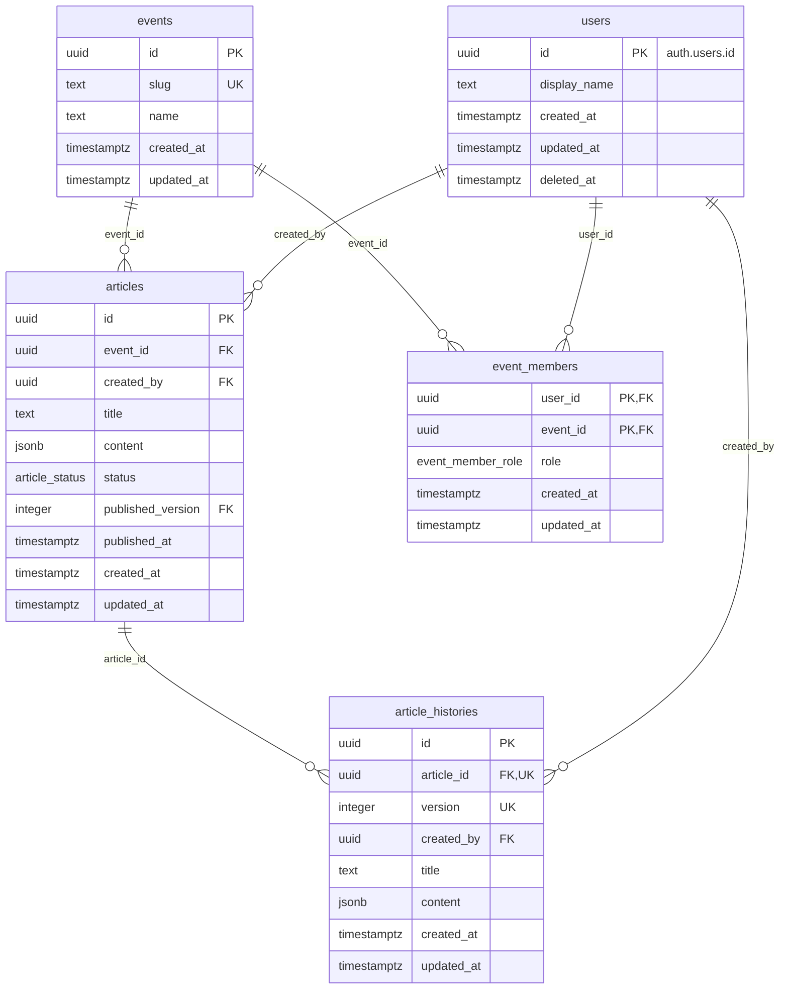

# DB仕様

## events

文化祭1つ = 1行。テナントの単位。

| 列           | 型            | NULL | 既定値              | 説明                              |
| ------------ | ------------- | ---- | ------------------- | --------------------------------- |
| `id`         | `uuid`        | NO   | `gen_random_uuid()` | 主キー                            |
| `slug`       | `text`        | NO   |                     | イベントの識別子。全体で一意      |
| `name`       | `text`        | NO   |                     | 文化祭の名前                      |
| `created_at` | `timestamptz` | NO   | `now()`             |                                   |
| `updated_at` | `timestamptz` | NO   | `now()`             | 更新時にトリガーで `now()` にする |

### 制約・インデックス

- `unique (slug)`

### RLS

| 操作                           | 許可する条件                |
| ------------------------------ | --------------------------- |
| `select`                       | そのイベントのメンバー      |
| `insert` / `update` / `delete` | なし（`service_role` のみ） |

## articles

記事のタイトルと本文。1行 = 1記事。

| 列                  | 型               | NULL | 既定値              | 説明                                                                                                                                                                       |
| ------------------- | ---------------- | ---- | ------------------- | -------------------------------------------------------------------------------------------------------------------------------------------------------------------------- |
| `id`                | `uuid`           | NO   | `gen_random_uuid()` | 主キー                                                                                                                                                                     |
| `event_id`          | `uuid`           | NO   |                     | `events.id`。イベントを消すと一緒に消える                                                                                                                                  |
| `created_by`        | `uuid`           | NO   |                     | `users.id`。記事を作成したユーザー。更新時はトリガーで元の値に戻す（変えられない）                                                                                         |
| `title`             | `text`           | NO   | `''`                | 記事のタイトル。100文字まで。空文字可。公開中なら公開している版の、下書きなら最新の版のタイトル                                                                            |
| `content`           | `jsonb`          | NO   | `'[]'`              | BlockNoteのブロック配列。形は `articleDocumentSchema`（`packages/schema/src/article.ts`）で検証する。公開中なら公開している版の、下書きなら最新の版の本文                  |
| `status`            | `article_status` | NO   | `'draft'`           | 公開状態。`draft`（下書き）/ `published`（公開）                                                                                                                           |
| `published_version` | `integer`        | YES  |                     | 公開中の版（`article_histories.version`）。下書きなら `NULL`。作成時のトリガーと `save_article` で決める                                                                   |
| `published_at`      | `timestamptz`    | YES  |                     | 初めて公開した日時。一度も公開していなければ `NULL`。作成・更新時にトリガーで決める（初めて `published` になったときに `now()`、以降は元の値に戻す。渡された値は使わない） |
| `created_at`        | `timestamptz`    | NO   | `now()`             |                                                                                                                                                                            |
| `updated_at`        | `timestamptz`    | NO   | `now()`             | 更新時にトリガーで `now()` にする                                                                                                                                          |

### 制約・インデックス

- `foreign key (event_id) references events (id) on delete cascade`
- `foreign key (created_by) references users (id)` … ユーザーは論理削除するので、記事を持つユーザーの行は消せない
- `foreign key (id, published_version) references article_histories (article_id, version)` … 存在しない版を公開中にできない
- `check (char_length(title) <= 100)`
- `index (event_id, updated_at desc)` … 一覧（イベント内で更新日時の新しい順）用
- `index (created_by)` … `users` の RLS で作成者を引く用

### RLS

| 操作     | 許可する条件                                                                                       |
| -------- | -------------------------------------------------------------------------------------------------- |
| `select` | `event_id` のイベントの `staff`。または `event_id` のイベントのメンバーで、`status` が `published` |
| `insert` | `event_id` のイベントの `staff` で、`created_by` が `auth.uid()`                                   |
| `update` | `event_id` のイベントの `staff`（更新後の `event_id` でも判定）                                    |
| `delete` | なし（`service_role` のみ）                                                                        |

### 保存（`save_article`）

`public.save_article(target_article_id, new_title, new_content, new_status)` で、版の追加と記事の更新を1トランザクションで行う。
呼び出したユーザーの権限で動くので、`articles` / `article_histories` の RLS がそのまま効く。
記事の行をロックしてから処理するので、同時に保存しても版の番号はずれない。

1. 記事の行を更新用に読む。読めない・更新できない（`articles` の RLS）ときは、何もせずに `false` を返す
2. 版を決める
    - タイトル・本文が最新の版と同じなら、版は作らない（最新の版を今回の版とする）
    - 次をすべて満たすときは、最新の版のタイトル・本文を上書きする
        - 最新の版の `created_by` が `auth.uid()`
        - 最新の版を作ってから30分以内（`created_at` で判定）
        - 最新の版が公開中の版（`published_version`）ではない
    - それ以外は、新しい版（最新の版の番号 + 1）を足す
3. `new_status` で記事を更新し、`true` を返す

| `new_status`   | 今が `draft`                                                                  | 今が `published`                                                                    |
| -------------- | ----------------------------------------------------------------------------- | ----------------------------------------------------------------------------------- |
| `NULL`（省略） | `title` / `content` を今回の中身にする                                        | 変えない（一時保存）                                                                |
| `published`    | `title` / `content` を今回の中身にし、`published`・今回の版を公開中の版にする | `title` / `content` を今回の中身にし、今回の版を公開中の版にする                    |
| `draft`        | `title` / `content` を今回の中身にする                                        | `title` / `content` を今回の中身にし、`draft` に戻す。`published_version` は `NULL` |

`anon` からは呼べない。

## article_histories

記事の編集履歴。1行 = 1記事の1版。版は一直線に増え、枝分かれしない。

| 列           | 型            | NULL | 既定値              | 説明                                                                           |
| ------------ | ------------- | ---- | ------------------- | ------------------------------------------------------------------------------ |
| `id`         | `uuid`        | NO   | `gen_random_uuid()` | 主キー                                                                         |
| `article_id` | `uuid`        | NO   |                     | `articles.id`。記事を消すと一緒に消える                                        |
| `version`    | `integer`     | NO   |                     | 版の番号。記事ごとに 1 から1ずつ増える                                         |
| `created_by` | `uuid`        | YES  |                     | `users.id`。その版を保存したユーザー。`service_role` から保存したときは `NULL` |
| `title`      | `text`        | NO   |                     | その版のタイトル                                                               |
| `content`    | `jsonb`       | NO   |                     | その版の本文。形は `articles.content` と同じ                                   |
| `created_at` | `timestamptz` | NO   | `now()`             | 版を作った日時                                                                 |
| `updated_at` | `timestamptz` | NO   | `now()`             | 版を上書きしたときにトリガーで `now()` にする                                  |

### 行の作成

- 記事を作ったときに、トリガーで版1を作る（タイトル・本文は作った記事と同じ、`created_by` は記事の作成者）。記事を `published` で作ったときは、`articles.published_version` を `1` にする
- 以降は `save_article`（`articles` の「保存」）で作る・上書きする
- 保持期間・件数の上限はない

### 制約・インデックス

- `unique (article_id, version)` … 記事の最新の版を引く用も兼ねる
- `check (char_length(title) <= 100)`
- `foreign key (article_id) references articles (id) on delete cascade`
- `foreign key (created_by) references users (id)`

### RLS

| 操作     | 許可する条件                                                                                            |
| -------- | ------------------------------------------------------------------------------------------------------- |
| `select` | `article_id` の記事のイベントの `staff`                                                                 |
| `insert` | `article_id` の記事のイベントの `staff` で、`created_by` が `auth.uid()`                                |
| `update` | `article_id` の記事のイベントの `staff`（更新後の行では `created_by` が `auth.uid()` であることも判定） |
| `delete` | なし（`service_role` のみ）                                                                             |

## users

ログインできる人1人 = 1行。Supabase Auth の `auth.users` と 1:1 で、ウェブアプリ・管理者サイトで共通。

| 列             | 型            | NULL | 既定値  | 説明                                                         |
| -------------- | ------------- | ---- | ------- | ------------------------------------------------------------ |
| `id`           | `uuid`        | NO   |         | 主キー。`auth.users.id`。Auth のユーザーを消すと一緒に消える |
| `display_name` | `text`        | YES  |         | 表示名。未設定なら `NULL`                                    |
| `created_at`   | `timestamptz` | NO   | `now()` |                                                              |
| `updated_at`   | `timestamptz` | NO   | `now()` | 更新時にトリガーで `now()` にする                            |
| `deleted_at`   | `timestamptz` | YES  |         | 論理削除した日時。削除していなければ `NULL`                  |

### 行の作成

- `auth.users` に行が入ったとき（メールアドレスでの新規登録・Google での初回ログイン）に、トリガーで1行作る
- `display_name` には `auth.users.raw_user_meta_data` の `full_name`（Google のアカウント名）を入れる。無ければ `NULL`（メールアドレスでの新規登録）

### 制約・インデックス

- `foreign key (id) references auth.users (id) on delete cascade`

### RLS

| 操作                           | 許可する条件                                                                                                      |
| ------------------------------ | ----------------------------------------------------------------------------------------------------------------- |
| `select`                       | `id` = `auth.uid()`、`private.shares_event_with(id)`、または読める記事（`articles` の RLS に従う）の `created_by` |
| `insert` / `update` / `delete` | なし（トリガーと `service_role` のみ）                                                                            |

## event_members

ユーザーがどのイベントに、どの役割で所属しているか。1行 = 1人の1イベントへの所属。
年度をまたいで複数のイベントに所属でき、イベントごとに役割が違ってよい。

| 列           | 型                  | NULL | 既定値  | 説明                                      |
| ------------ | ------------------- | ---- | ------- | ----------------------------------------- |
| `user_id`    | `uuid`              | NO   |         | `users.id`。ユーザーを消すと一緒に消える  |
| `event_id`   | `uuid`              | NO   |         | `events.id`。イベントを消すと一緒に消える |
| `role`       | `event_member_role` | NO   |         | `staff`（運営）/ `visitor`（来場者）      |
| `created_at` | `timestamptz`       | NO   | `now()` |                                           |
| `updated_at` | `timestamptz`       | NO   | `now()` | 更新時にトリガーで `now()` にする         |

脱退は行を消す（論理削除しない）。

### 制約・インデックス

- `primary key (user_id, event_id)`
- `foreign key (user_id) references users (id) on delete cascade`
- `foreign key (event_id) references events (id) on delete cascade`
- `index (event_id)` … イベントのメンバーを引く用

### 所属の判定

RLS から次の関数を呼んで判定する。`private` スキーマに置き、API（PostgREST）からは呼べない。
`security definer` で、`event_members` 自身の RLS を通さずに引く。

| 関数                                 | `true` を返す条件                                                                                                                          |
| ------------------------------------ | ------------------------------------------------------------------------------------------------------------------------------------------ |
| `private.is_event_member(event_id)`  | `auth.uid()` の `event_members` の行があり、`users` が論理削除されていない                                                                 |
| `private.is_event_staff(event_id)`   | 上に加えて、`role` が `staff`                                                                                                              |
| `private.shares_event_with(user_id)` | `user_id` と `auth.uid()` が同じイベントに所属していて、`auth.uid()` の `users` が論理削除されていない（`user_id` 側の論理削除は問わない） |

### RLS

| 操作                           | 許可する条件                |
| ------------------------------ | --------------------------- |
| `select`                       | `user_id` = `auth.uid()`    |
| `insert` / `update` / `delete` | なし（`service_role` のみ） |
