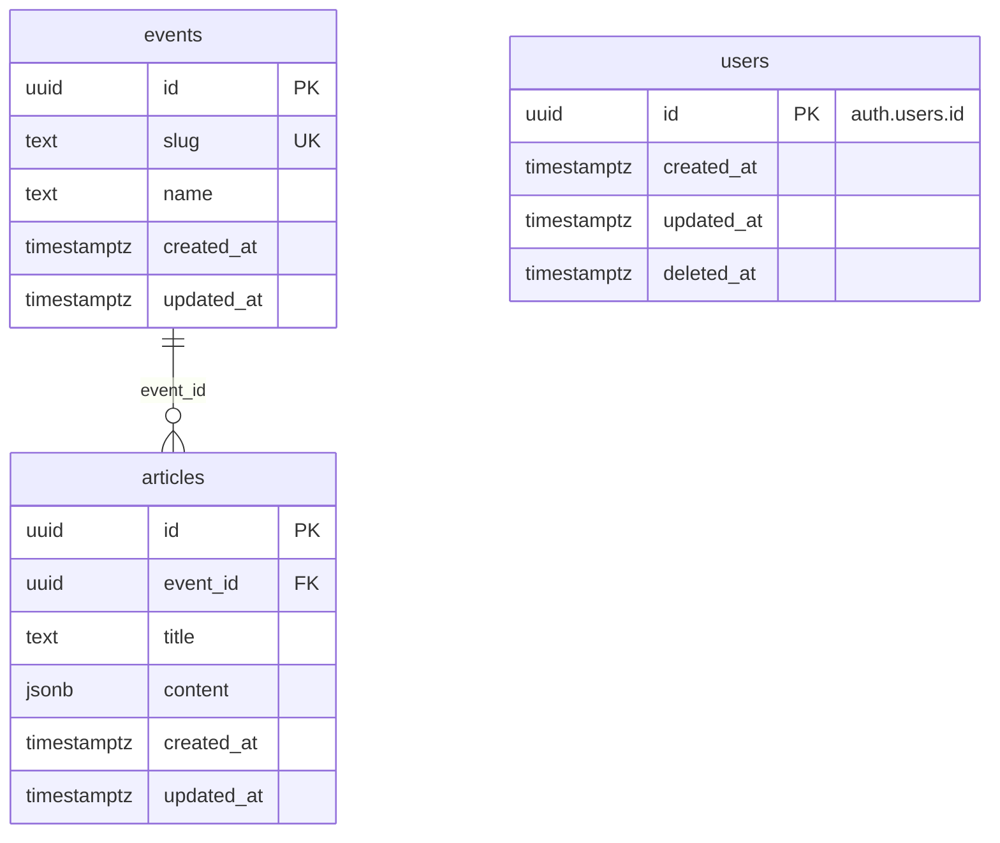

# DB仕様

## events

文化祭1つ = 1行。テナントの単位。

| 列           | 型            | NULL | 既定値              | 説明                              |
| ------------ | ------------- | ---- | ------------------- | --------------------------------- |
| `id`         | `uuid`        | NO   | `gen_random_uuid()` | 主キー                            |
| `slug`       | `text`        | NO   |                     | イベントの識別子。全体で一意      |
| `name`       | `text`        | NO   |                     | 文化祭の名前                      |
| `created_at` | `timestamptz` | NO   | `now()`             |                                   |
| `updated_at` | `timestamptz` | NO   | `now()`             | 更新時にトリガーで `now()` にする |

### 制約・インデックス

- `unique (slug)`

### RLS

| 操作                           | 許可する条件                          |
| ------------------------------ | ------------------------------------- |
| `select`                       | `id` = JWT の `app_metadata.event_id` |
| `insert` / `update` / `delete` | なし（`service_role` のみ）           |

## articles

記事のタイトルと本文。1行 = 1記事。

| 列           | 型            | NULL | 既定値              | 説明                                                                                                |
| ------------ | ------------- | ---- | ------------------- | --------------------------------------------------------------------------------------------------- |
| `id`         | `uuid`        | NO   | `gen_random_uuid()` | 主キー                                                                                              |
| `event_id`   | `uuid`        | NO   |                     | `events.id`。イベントを消すと一緒に消える                                                           |
| `title`      | `text`        | NO   | `''`                | 記事のタイトル。100文字まで。空文字可                                                               |
| `content`    | `jsonb`       | NO   | `'[]'`              | BlockNoteのブロック配列。形は `articleDocumentSchema`（`packages/schema/src/article.ts`）で検証する |
| `created_at` | `timestamptz` | NO   | `now()`             |                                                                                                     |
| `updated_at` | `timestamptz` | NO   | `now()`             | 更新時にトリガーで `now()` にする                                                                   |

### 制約・インデックス

- `foreign key (event_id) references events (id) on delete cascade`
- `check (char_length(title) <= 100)`
- `index (event_id, updated_at desc)` … 一覧（イベント内で更新日時の新しい順）用

### RLS

| 操作                                      | 許可する条件                                |
| ----------------------------------------- | ------------------------------------------- |
| `select` / `insert` / `update` / `delete` | `event_id` = JWT の `app_metadata.event_id` |

## users

ログインできる人1人 = 1行。Supabase Auth の `auth.users` と 1:1 で、ウェブアプリ・管理者サイトで共通。

| 列           | 型            | NULL | 既定値  | 説明                                                         |
| ------------ | ------------- | ---- | ------- | ------------------------------------------------------------ |
| `id`         | `uuid`        | NO   |         | 主キー。`auth.users.id`。Auth のユーザーを消すと一緒に消える |
| `created_at` | `timestamptz` | NO   | `now()` |                                                              |
| `updated_at` | `timestamptz` | NO   | `now()` | 更新時にトリガーで `now()` にする                            |
| `deleted_at` | `timestamptz` | YES  |         | 論理削除した日時。削除していなければ `NULL`                  |

### 行の作成

- `auth.users` に行が入ったとき（メールアドレスでの新規登録・Google での初回ログイン）に、トリガーで1行作る

### 制約・インデックス

- `foreign key (id) references auth.users (id) on delete cascade`

### RLS

| 操作                           | 許可する条件                           |
| ------------------------------ | -------------------------------------- |
| `select`                       | `id` = `auth.uid()`                    |
| `insert` / `update` / `delete` | なし（トリガーと `service_role` のみ） |
